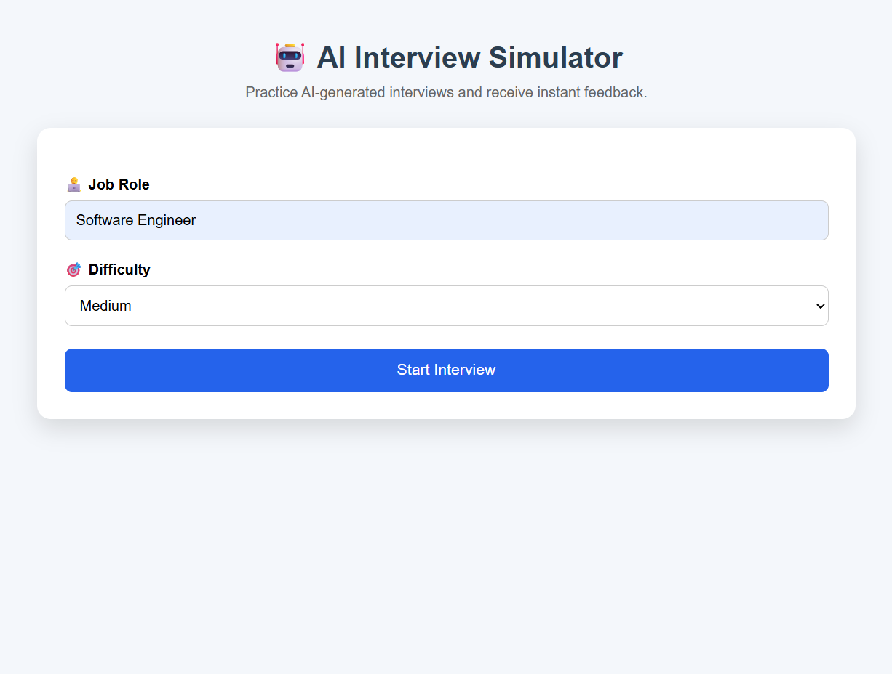
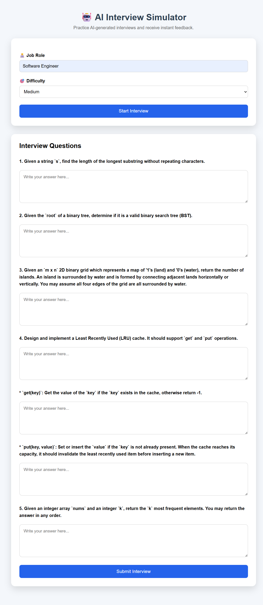
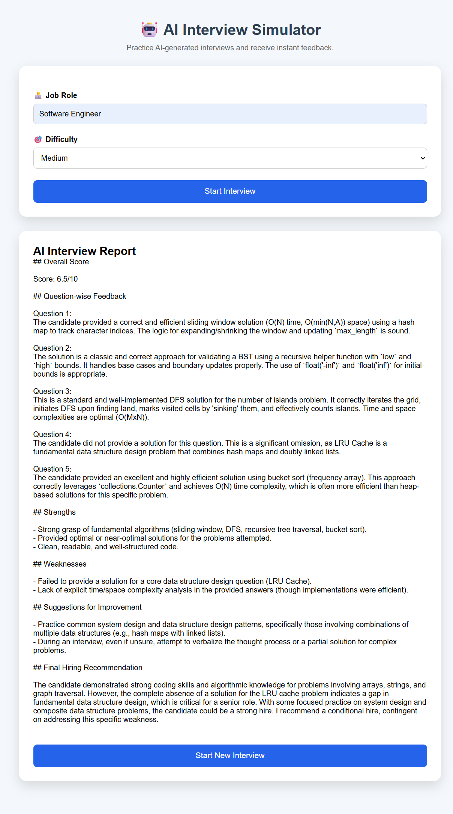

# 🤖 AI Interview Simulator

An AI-powered Interview Simulator that generates technical interview questions based on a selected job role and difficulty level, then evaluates your answers using Google's Gemini AI.

---

## 🚀 Live Demo

### 🌐 Frontend (Vercel)

https://ai-interview-simulator-nu.vercel.app/

### ⚙️ Backend (Render)

https://ai-interview-simulator-ymw8.onrender.com/

---

## ✨ Features

- Generate AI-powered interview questions
- Choose interview difficulty (Easy, Medium, Hard)
- Answer each question directly in the browser
- Receive AI-generated evaluation and feedback
- Responsive and clean user interface
- Real-time communication between frontend and backend

---

## 🛠️ Tech Stack

### Frontend
- HTML5
- CSS3
- JavaScript

### Backend
- Flask
- Flask-CORS
- Python

### AI
- Google Gemini 2.5 Flash API

### Deployment
- Vercel (Frontend)
- Render (Backend)

### Version Control
- Git
- GitHub

---

## 📂 Project Structure

```
## 📂 Project Structure

AI-Interview-Simulator/

├── backend/
│   ├── app.py
│   ├── requirements.txt
│   └── .gitignore
│
├── frontend/
│   ├── index.html
│   ├── script.js
│   └── style.css
│
├── images/
│   ├── home.png
│   ├── interview.png
│   └── report.png
│
├── .gitignore
└── README.md
```

---

## ⚙️ Installation

### Clone the repository

```bash
git clone https://github.com/karamchandsuresh/AI-Interview-Simulator.git
```

Move into the project

```bash
cd AI-Interview-Simulator
```

---

### Backend Setup

```bash
cd backend

python -m venv venv

# Windows
venv\Scripts\activate

pip install -r requirements.txt
```

Create a `.env` file inside the `backend` folder.

```env
GEMINI_API_KEY=YOUR_GEMINI_API_KEY
```

Run the Flask server.

```bash
python app.py
```

---

### Frontend Setup

Open the `frontend` folder and launch `index.html` using Live Server (VS Code) or any local web server.

---

## 📸 Screenshots

### 🏠 Home Page



---

### ❓ Interview Questions



---

### 📊 AI Evaluation Report



---

## 🎯 Future Improvements

- Voice-based interviews
- Resume upload support
- User authentication
- Interview history
- Downloadable PDF report
- Performance analytics dashboard

---

## 👨‍💻 Author

**Karamchand Suresh**

GitHub:
https://github.com/karamchandsuresh

---

## ⭐ If you like this project

Please consider giving this repository a ⭐ on GitHub.
